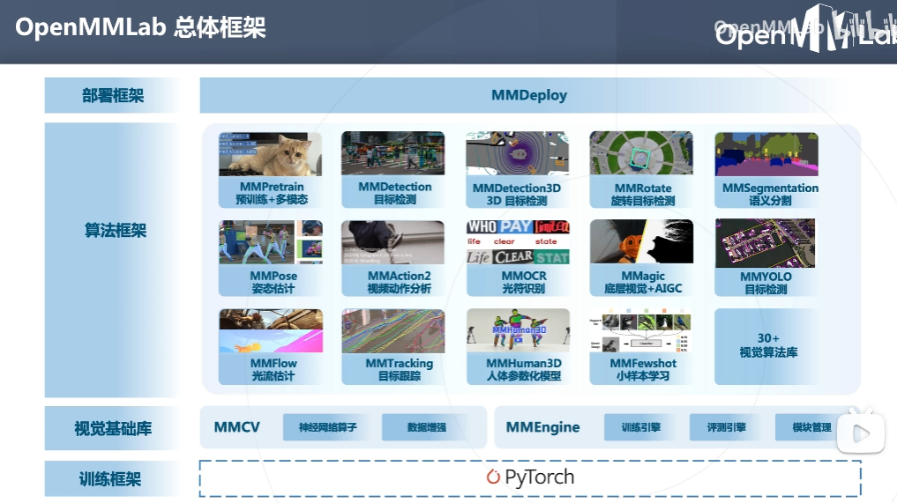
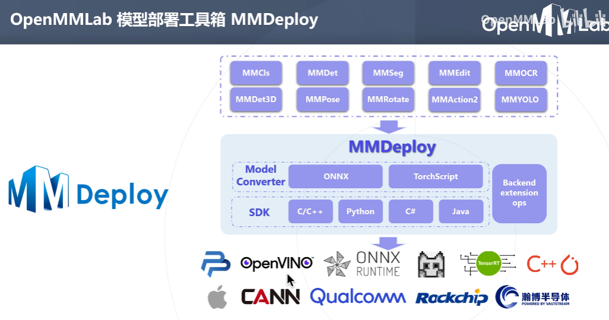

# 课程综述笔记

## OpenMMLab

### 1. 概述
统一的深度学习框架 -> 统一的算法框架和生态，是一个大一统框架，包括图像识别，计算机视觉领域。

#### 1.1 [目标检测算法库mmdetection](https://github.com/open-mmlab/mmdetection) 

任务支持目标检测，实例分割，全景分割全面的论文和算法实现，模型mmtetection已经实现
#### 1.2 [目标检测算法库mmyolo](https://github.com/open-mmlab/mmyolo)

特点：速度快

#### 1.3 [文字检测识别算法库mmocr](https://github.com/open-mmlab/mmocr)

解决文本检测， 文本识别，关键信息提取（结构化的票据，文件），兼容中英文，数字

#### 1.4 [3D目标检测算法库MMDetection3D](https://github.com/open-mmlab/mmdetection3d)

3d目标检测算法库，通过激光或毫米波雷达感知3d点云数据进行3d目标检测， 用例： 无人驾驶

#### 1.5 [旋转目标检测算法库MMRotate](https://github.com/open-mmlab/mmrotate)

提供了旋转框检测任务中最先进的算法和强大的基准模型

#### 1.6 [图像分割算法库MMSegmentation](https://github.com/open-mmlab/mmsegmentation)

给每个像素分类， 语义分割，应用： 医疗影像，卫星遥感图像，街景等

#### 1.7 [图像分类+预训练+多模态MMPretrain](https://github.com/open-mmlab/mmpretrain)

图像分类， 图像描述，视觉问答，视觉定位， 检索

#### 1.8 [姿态估计MMPose](https://github.com/open-mmlab/mmpose)

支持人，动物的2d，3d检测（姿态，关键点等）

#### 1.9 [三维人体姿态估计算法库MMHuman3D](https://github.com/open-mmlab/mmhuman3d)

3D模型勾勒出人体，可以应用于动作捕捉和虚拟现实

#### 1.10 [视频动作识别算法MMAction2](https://github.com/open-mmlab/mmaction2)

通过视频判断人物的动作，实现动作识别，时序检测，时空检测（应用：手语翻译）

#### 1.11 [生成模型+底层视觉+AIGC算法MMagic](https://github.com/open-mmlab/mmagic)

文生图，降噪，超分辨率，插帧，图生图，图片上色，图像填充， stable difussion, dreambooth, control net

### 2. 模型终端部署应用场景

运算在本地终端进行，本地终端硬件多样，算例薄弱，还有数据隐私要求。

#### 2.1 [模型部署工具箱MMDeploy](https://github.com/open-mmlab/mmdeploy)

将各种算法库训练的模型通过MMDeploy进行转换和部署

### 3. playground

#### 3.1 [playground](https://github.com/open-mmlab/playground)

前沿应用探索

#### 3.2 [MMTracking目标追踪](https://github.com/open-mmlab/mmtracking)

AI感知与目标追踪，应用：航拍跟拍功能，人流量（商业数据挖掘）

## 总结

OpenMMLab是一个支持从数据 -》 训练，算法 -》 应用部署全流程的大一统框架，生态丰富，社区强大。

# 翻译

# Course Overview Notes

## OpenMMLab

### 1. Overview
A unified deep learning framework with unified algorithm framework and ecosystem covering image recognition and computer vision.

#### 1.1 [Object detection algorithm library mmdetection](https://github.com/open-mmlab/mmdetection) 

Supports object detection, instance segmentation, and panoptic segmentation with comprehensive papers and algorithm implementation. The mmdetection model has been implemented.

#### 1.2 [Object detection algorithm library mmyolo](https://github.com/open-mmlab/mmyolo)

Features: Fast speed

#### 1.3 [Text detection and recognition algorithm library mmocr](https://github.com/open-mmlab/mmocr)

Solves text detection, text recognition, and key information extraction (structured invoices, documents). Compatible with Chinese, English and numbers.

#### 1.4 [3D object detection algorithm library MMDetection3D](https://github.com/open-mmlab/mmdetection3d)

A 3D object detection algorithm library that detects 3D objects through laser or millimeter-wave radar perception of 3D point cloud data. Use case: autonomous driving

#### 1.5 [Rotating object detection algorithm library MMRotate](https://github.com/open-mmlab/mmrotate)

Provides the most advanced algorithms and powerful benchmark models for rotating box detection tasks.

#### 1.6 [Image segmentation algorithm library MMSegmentation](https://github.com/open-mmlab/mmsegmentation)

Classifies each pixel, semantic segmentation, applications: medical imaging, satellite remote sensing images, street scenes, etc.

#### 1.7 [Image classification+pre-training+multi-modal MMPretrain](https://github.com/open-mmlab/mmpretrain)

Image classification, image description, visual question answering, visual localization, retrieval

#### 1.8 [Pose estimation MMPose](https://github.com/open-mmlab/mmpose)

Supports 2D and 3D detection of humans and animals (poses, keypoints, etc.)

#### 1.9 [3D human pose estimation algorithm library MMHuman3D](https://github.com/open-mmlab/mmhuman3d)

3D models outline the human body, which can be applied to motion capture and virtual reality.

#### 1.10 [Video action recognition algorithm MMAction2](https://github.com/open-mmlab/mmaction2)

Judges human actions through videos to achieve action recognition, temporal detection, and spatiotemporal detection (applications: sign language translation)

#### 1.11 [Generation model+bottom-up vision+AIGC algorithm MMagic](https://github.com/open-mmlab/mmagic)

WenShengTu, denoising, super-resolution, interpolation, image generation, image coloring, image filling, stable diffusion, dreambooth, control net

### 2. Model terminal deployment application scenarios

Computations are performed on local terminals with various hardware and weak algorithms and with data privacy requirements.

#### 2.1 [Model deployment toolbox MMDeploy](https://github.com/open-mmlab/mmdeploy)

Convert and deploy models trained from various algorithm libraries using MMDeploy.

### 3. Playground

#### 3.1 [Playground](https://github.com/open-mmlab/playground)

Exploring cutting-edge applications.

#### 3.2 [MMTracking Object Tracking](https://github.com/open-mmlab/mmtracking)

AI perception and object tracking, applications: aerial follow-up, people flow (commercial data mining)

## Summary

OpenMMLab is a unified framework that supports the entire process from data to training, algorithm to application deployment, with a rich ecosystem and strong community.