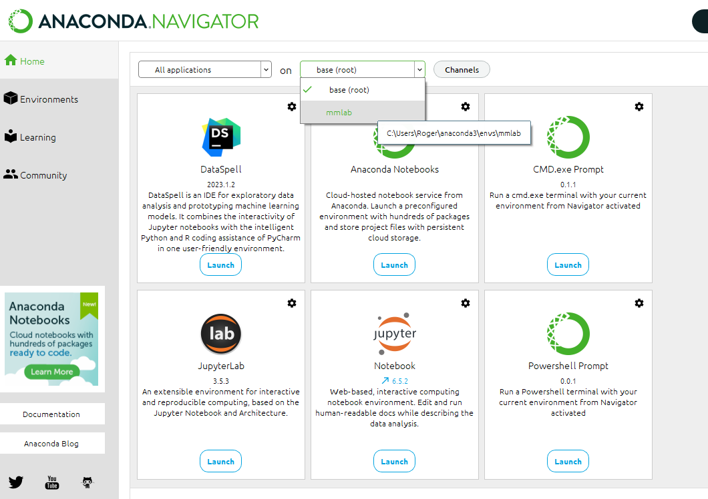
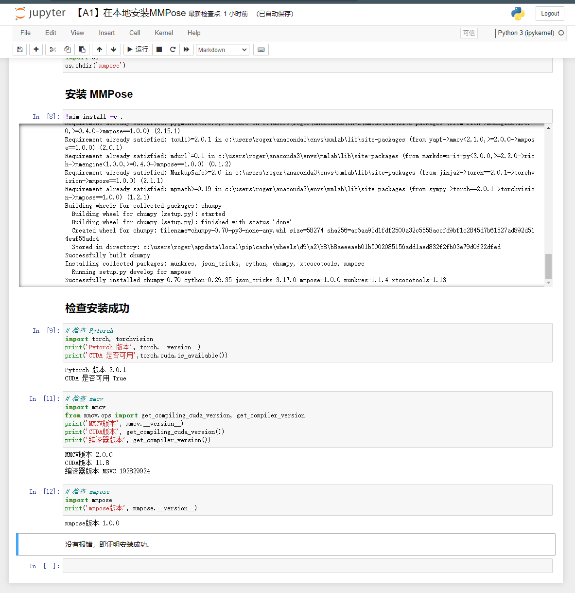
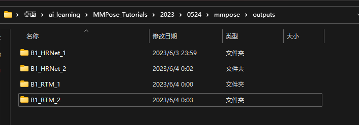
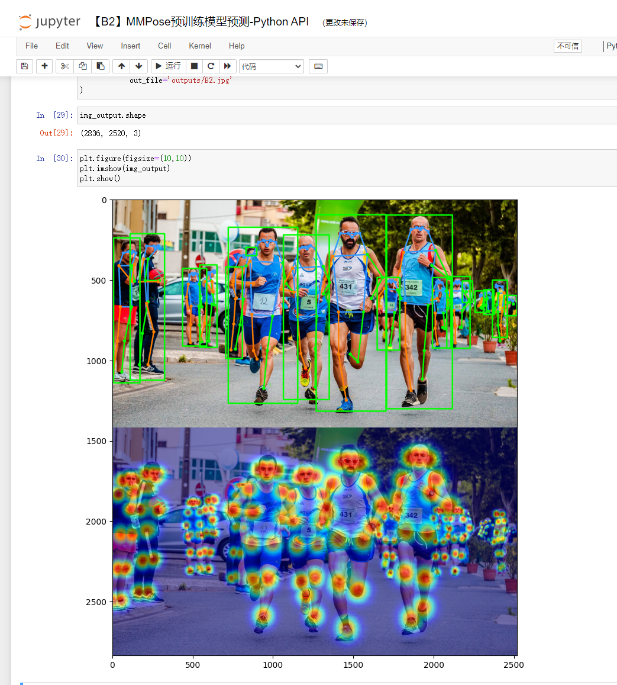

# MMPose 关键点检测全流程

数据（Labelme标注数据集， MS COCO格式数据集） =》 模型（MMdetection， MMPose） => 部署（MMDeploy）

## 安装MMPose 和MMDetection

将[MMPose_Toturials](github.com/TommyZihao/MMPose_Tutorials) fork到本地自己的仓库，方便提交修改代码。

*我的环境是win11，全局挂vpn*


### 1. conda配置

总体思路，在conda中配置一个新环境，然后再jupyter中选择对应的环境开发，参考[Jupyter notebook选择conda环境](https://www.jianshu.com/p/5eed417e04ca)配置和选择环境

### 2. 创建conda环境
```
# 创建环境
conda create -n mmlab python=3.8
# 查看环境列表
conda env list
# 进入对应环境
conda activate mmlab
```

### 3. 安装pytorch，参考[pytorch安装](https://pytorch.org/get-started/locally/)
```
conda install pytorch torchvision torchaudio pytorch-cuda=11.8 -c pytorch -c nvidia
```

### 4. 根据【A1】在本地安装MMPose 文档继续安装

#### 4.1 注意需要在anacondda环境启动jupyter时，选择对应的环境，比如刚才新建的mmlab



### 4.2 conda 环境中安装 wget 可以通过以下命令实现

```
conda install -c anaconda wget

# 如果找不到wget，添加社区channel重新搜索
conda config --add channels conda-forge

# 上面还是不行
conda install -c menpo wget

# wget如果有问题， 直接下载测试文件到/data/test

```


### 5. 结果

#### 5.1 mmpose安装结果



#### 5.2 mmdetection安装结果


#### 5.3 mmpose训练结果（分别在对应文件夹，效果同教程）



#### 5.4 自顶而下python API


