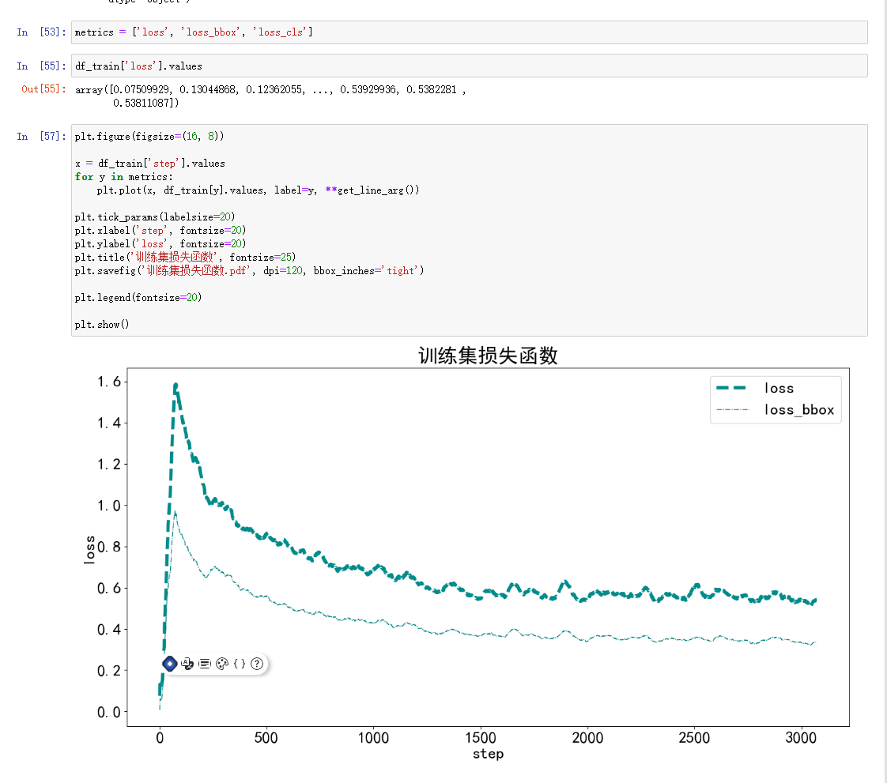
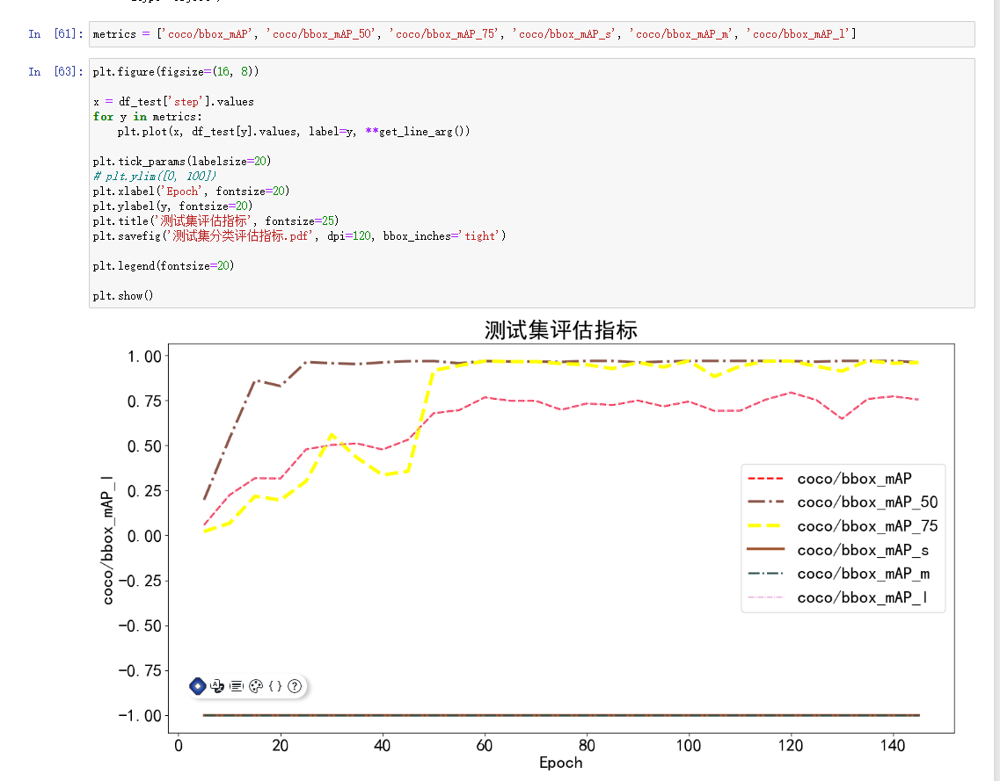
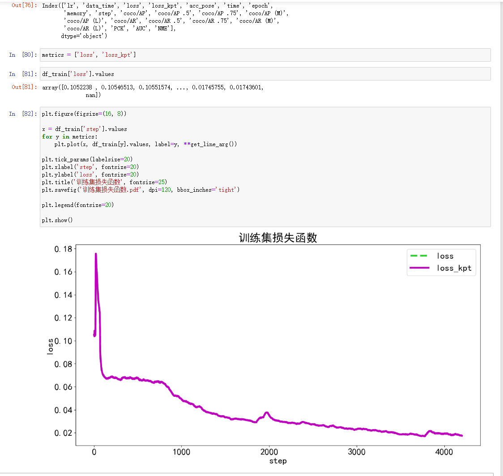
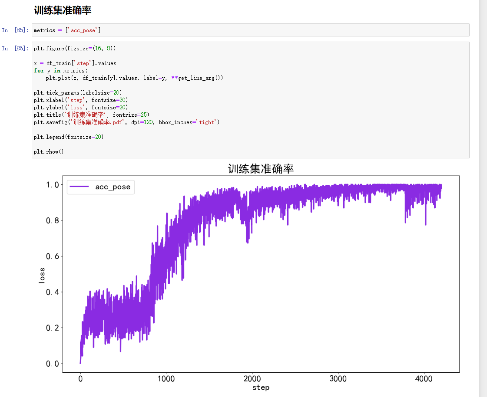

# 实战作业


1. 将Ear210_Keypoint_Dataset_coco数据集拷贝至mmpose和mmdetection对应的data目录
2. 将config配置文件拷贝到mmpose和mmdetection对应的data目录, 运行train.py

```
!python tools/train.py data/faster_r_cnn_triangle.py
```
3. 训练
```
注意点：
rtmpose-s-ear.py 训练速度非常慢，gpu吃不满，更改了训练参数
max_epochs = 200 # 训练 epoch 总数
val_interval = 5 # 每隔多少个 epoch 保存一次权重文件
train_cfg = {'max_epochs': max_epochs, 'val_interval': val_interval}
train_batch_size = 8
val_batch_size = 4
stage2_num_epochs = 20
base_lr = 0.004
randomness = dict(seed=21)
```

3. MMDetection测试集评估指标

    3.1 训练集损失函数



    3.2 测试集评估指标




4. MMPose测试集评估指标

    4.1 训练集损失函数


    4.2 训练集准确率



5. 输出(有些问题， 正在解决)


