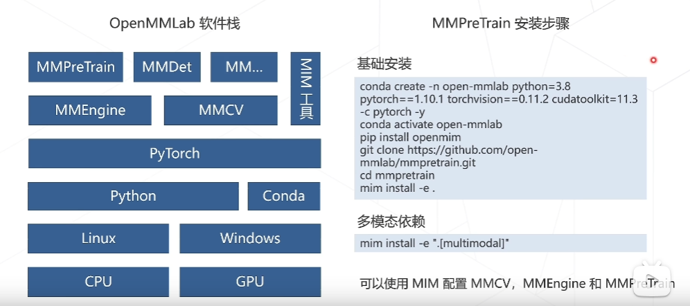
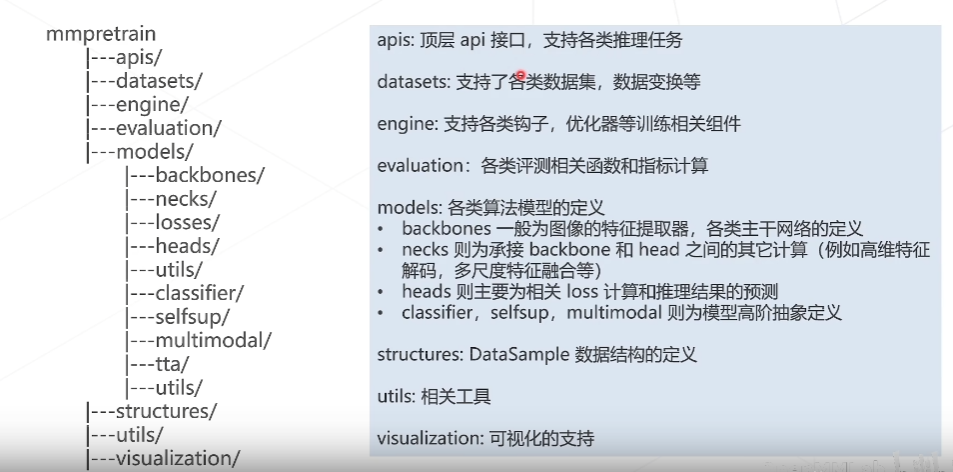

# MMPretrain

全新升级的预训练开源算法框架， 提供强大的预训练主干网络， 支持不同的预训练策略。

# 链接
[代码仓库](https://github.com/open-mmlab/mmpretrain)

[中文教程](https://mmpretrain.readthedocs.io/zh_CN/latest/index.html)

# 相关任务

图像分类，描述，视觉问答，定位， 检索

# 安装步骤

# 代码框架

# 经典主干网络

堆叠网络层数， 可以获得更好的结果，但当增加到一定程度，分类正确率不增反降。

# 残差建模

让新增加的层拟合浅层网络与深层网络之间的差异，更容易学习梯度可以直接回传到浅层网络监督浅层网络的学习，没有引入额外参数，让参数更有效贡献到最终模型中。

# 总结

这个视频是关于深度学习预训练和MMPretrain的课程。首先介绍了MP train算法库的相关内容，包括任务组成和框架概览，并介绍了经典主干网络，如ResNet和Vision Transformer。接着讲解了自监督学习和提供的多模态相关的数据集，如COCO Sense QA等，以及相应的推理接口。通过代码框架获取相关推理任务的结果，如高维特征的解码和对图像进行提问。讲解了在优化方面学习率下降算法的选取以及模型更新和优化。接着介绍了在ResNet18和ResNet34中浅层网络加深的一种有效设计实验，以及VGG网络为基础增加跨层连接，从而使得整个网络的结构共有五层，分辨率为112x112。讲解了Vision Transformer的多层Transformer Encoder的计算和局部的建模关系，以及通过对应的Q去查询所有的K，从而对不同的特征进行分特征表达，并将其进行上色，解决Jigsaw Puzzle问题。接着讲解了对比学习在网络提取到特征表达之后的负样本对，并提取出来的特征都应该极为相似。最后介绍了CLIP作为一个优秀的Zero Shot，可以作为视觉测的基础模型，分别处理文本和图像数据，并将两种方法进行了结合。最后介绍了VIP网络，即从图像检索到language instruction，通过对齐的形式获得相应的language response。