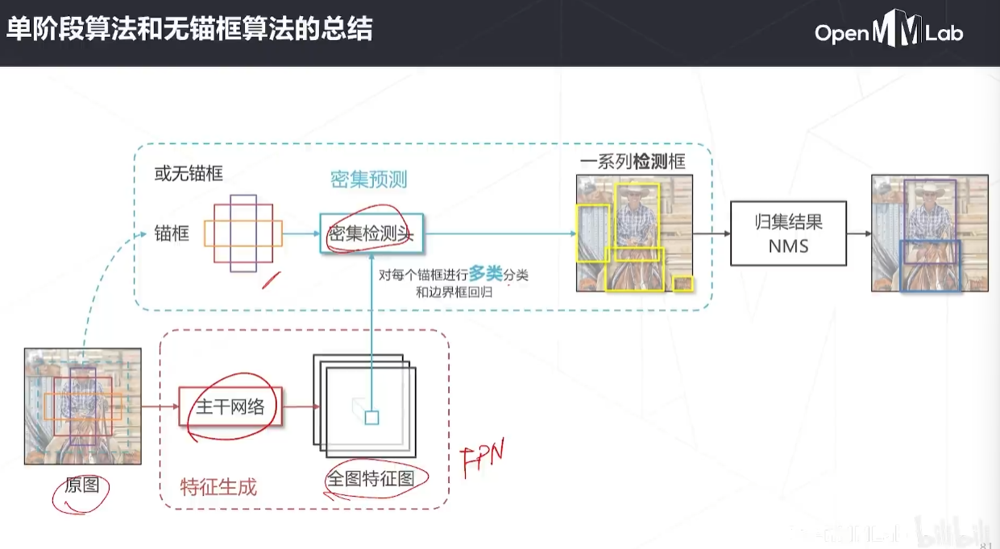

# 目标检测的基本范式

## 什么是目标检测

给定一张图片，框出所有感兴趣物体，同时预测物体类别。

## 与图像分类的区别

与图像分类相比，目标检测物体数量，位置，大小不固定

应用： 人脸识别，智慧城市，自动驾驶，下游视觉任务 

## 技术演进

# 算法

### 边界框

通常指紧密包围感兴趣物体的框

### 交并比

矩形框重合程度的衡量指标

## 基本思路

### 难点

同时解决“是什么”和“在哪里

图中物体位置，数量，尺度变化多样

### 滑窗

1. 设定一个固定大小窗口
2. 遍历图像所有位置， 所到之处用分类模型（已经训练好）识别窗口中的内容

消除滑窗中的重复计算，改进思路，用卷积一次性计算所有特征， 再取对应位置的特征完成分类。

### 感受野

神经网络中，一个神经元能“看到”的原图区域

### 有效感受野

影响比较大的像素通常聚集再中间区域， 可以认为对应神经元提取了有效感受野范围内的特征。

### YOLO: you only look once

最早的单阶段检测器之一，激发了单阶段算法的研究潮流

### yolov5

[link](https://github.com/ultralytics/yolov5)

### 无锚框

对于同一个位置的重叠物体， FCOS： fully convolutional one-stage。

### 中心度

几何意义： 位置越靠近边界框中心越接近1，越靠近边界越接近0

### controlnet

将传统检测算法中的以框表示物体，变成以中心点表示物体，将2d检测建模为关键点检测和额外的回归任务， 一个框架可以同时覆盖2d检测，3d检测，姿态估计等一系列任务

### 单阶段算法和无锚框算法的总结

