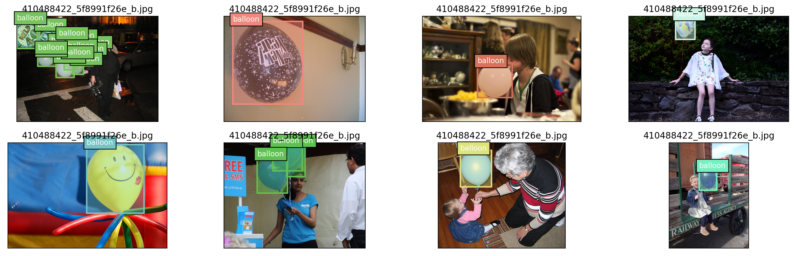

# mmdet 气球检测训练成果

## 训练集可视化



## 模型训练

```
06/11 15:08:22 - mmengine - INFO - 
------------------------------------------------------------
System environment:
    sys.platform: win32
    Python: 3.8.16 (default, Mar  2 2023, 03:18:16) [MSC v.1916 64 bit (AMD64)]
    CUDA available: True
    numpy_random_seed: 841357311
    GPU 0: NVIDIA GeForce RTX 4090
    CUDA_HOME: C:\Program Files\NVIDIA GPU Computing Toolkit\CUDA\v12.1
    NVCC: Cuda compilation tools, release 12.1, V12.1.105
    MSVC: 用于 x64 的 Microsoft (R) C/C++ 优化编译器 19.36.32532 版
    GCC: n/a
    PyTorch: 2.0.1
    PyTorch compiling details: PyTorch built with:
  - C++ Version: 199711
  - MSVC 193431937
  - Intel(R) Math Kernel Library Version 2020.0.2 Product Build 20200624 for Intel(R) 64 architecture applications
  - Intel(R) MKL-DNN v2.7.3 (Git Hash 6dbeffbae1f23cbbeae17adb7b5b13f1f37c080e)
  - OpenMP 2019
  - LAPACK is enabled (usually provided by MKL)
  - CPU capability usage: AVX2
  - CUDA Runtime 11.8
  - NVCC architecture flags: -gencode;arch=compute_37,code=sm_37;-gencode;arch=compute_50,code=sm_50;-gencode;arch=compute_60,code=sm_60;-gencode;arch=compute_61,code=sm_61;-gencode;arch=compute_70,code=sm_70;-gencode;arch=compute_75,code=sm_75;-gencode;arch=compute_80,code=sm_80;-gencode;arch=compute_86,code=sm_86;-gencode;arch=compute_90,code=sm_90;-gencode;arch=compute_37,code=compute_37
  - CuDNN 8.7
  - Magma 2.5.4
...
 Average Recall     (AR) @[ IoU=0.50:0.95 | area=medium | maxDets=100 ] = 0.725
 Average Recall     (AR) @[ IoU=0.50:0.95 | area= large | maxDets=100 ] = 0.942
06/11 15:08:35 - mmengine - INFO - bbox_mAP_copypaste: 0.781 0.876 0.867 0.000 0.483 0.915
06/11 15:08:35 - mmengine - INFO - Epoch(test) [13/13]  coco/bbox_mAP: 0.7810  coco/bbox_mAP_50: 0.8760  coco/bbox_mAP_75: 0.8670  coco/bbox_mAP_s: 0.0000  coco/bbox_mAP_m: 0.4830  coco/bbox_mAP_l: 0.9150  data_time: 0.6694  time: 0.7079
Output is truncated. View as a scrollable element or open in a text editor. Adjust cell output settings...
c:\Users\Roger\anaconda3\envs\mmlab\lib\site-packages\torch\functional.py:504: UserWarning: torch.meshgrid: in an upcoming release, it will be required to pass the indexing argument. (Triggered internally at C:\cb\pytorch_1000000000000\work\aten\src\ATen\native\TensorShape.cpp:3484.)
  return _VF.meshgrid(tensors, **kwargs)  # type: ignore[attr-defined]
c:\Users\Roger\anaconda3\envs\mmlab\lib\site-packages\mmengine\visualization\visualizer.py:741: UserWarning: Warning: The bbox is out of bounds, the drawn bbox may not be in the image
  warnings.warn(
c:\Users\Roger\anaconda3\envs\mmlab\lib\site-packages\mmengine\visualization\visualizer.py:812: UserWarning: Warning: The polygon is out of bounds, the drawn polygon may not be in the image
  warnings.warn(
```

## 模型测试


## 可视化分析

### backbone


### neck


## grad_Based Cam 可视化

### neck[2]


### neck[1]


### neck[0]
